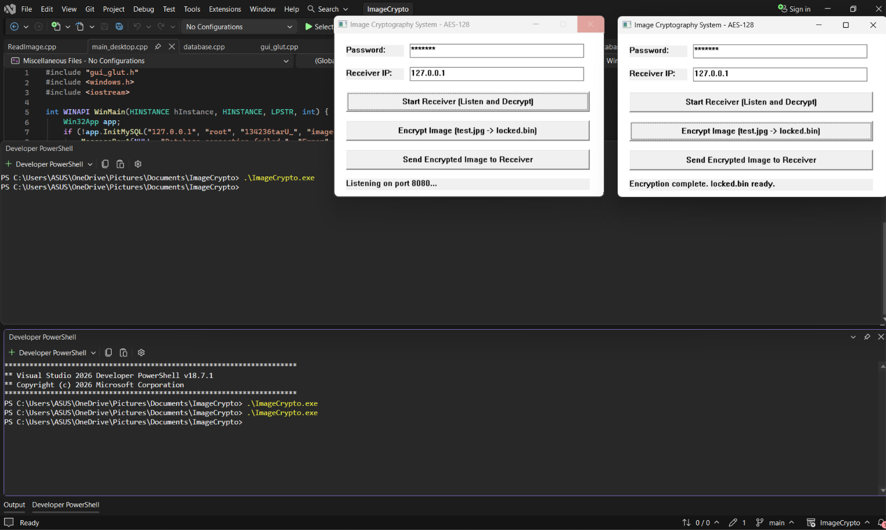
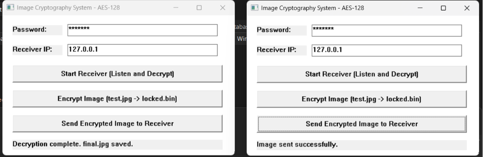

# Image Cryptography System (AES-128)

A C++ desktop application for secure image encryption, decryption, and transfer over a network — built with a native Win32 GUI, AES-128 CBC encryption, MySQL audit logging, and TCP socket-based file transfer.

## Features

- **AES-128 CBC Encryption** — manually implemented encryption/decryption for image files
- **Native Win32 GUI** — lightweight desktop interface built directly on the Windows API (no external GUI frameworks)
- **Network Transfer** — send and receive encrypted images over TCP sockets using Winsock2
- **MySQL Audit Logging** — every operation (encrypt, decrypt, send, receive) is logged to a MySQL database with timestamps and status
- **Password-Based Security** — encryption key derived from a user-provided password

## Tech Stack

- **Language:** C++
- **GUI:** Win32 API
- **Encryption:** AES-128 CBC (manual implementation)
- **Database:** MySQL 8.0 (via MySQL Connector C 6.1)
- **Networking:** Winsock2 (TCP sockets)
- **Compiler:** MinGW-w64 (g++, 64-bit)

## Demo

Two instances of the application running together — one as receiver, one as sender:





## Architecture

| Component | File | Responsibility |
|---|---|---|
| Entry Point | `main_desktop.cpp` | Initializes MySQL connection and launches the GUI |
| GUI | `gui_glut.cpp` / `gui_glut.h` | Win32 window, controls, and event handling |
| Encryption | `Encrypt.cpp` | AES-128 CBC image encryption/decryption logic |
| Sender | `sender.cpp` | Dispatches encrypted payload over TCP |
| Receiver | `receiver.cpp` | Listens for incoming payload and triggers decryption |
| Networking | `network.cpp` | Low-level socket utilities (Winsock2) |
| Database | `database.cpp` | MySQL connection and audit log queries |

## How It Works

1. **Encrypt:** User enters a password and clicks "Encrypt Image" — `test.jpg` is encrypted using AES-128 CBC and saved as `locked.bin`
2. **Send:** The encrypted `locked.bin` is sent to a receiver's IP address over a TCP socket
3. **Receive:** A second instance of the app listens on a port, receives the encrypted payload, and decrypts it using the same password into `final.jpg`
4. **Audit Log:** Every operation's status (success/failure) is logged to a MySQL table (`system_crypto_audit`) with a timestamp

## Setup & Installation

### Prerequisites

- Windows 10/11 (64-bit)
- [MSYS2](https://www.msys2.org/) with MinGW-w64 (`mingw-w64-x86_64-gcc`)
- MySQL Server 8.0
- MySQL Connector C 6.1 (64-bit)

### Build Instructions

1. Clone the repository:
```bash
   git clone https://github.com/tarushi78/image-cryptography-aes.git
   cd image-cryptography-aes
```

2. Update the MySQL credentials in `main_desktop.cpp` (host, user, password, database name) if needed.

3. Compile using MinGW-w64 g++:
```bash
   g++ main_desktop.cpp sender.cpp receiver.cpp database.cpp gui_glut.cpp Encrypt.cpp network.cpp -o ImageCrypto.exe -mwindows -I"C:\Program Files\MySQL\MySQL Connector C 6.1\include" -L"C:\Program Files\MySQL\MySQL Connector C 6.1\lib" -lws2_32 -lmysql -lgdi32
```

4. Run the application:
```bash
   .\ImageCrypto.exe
```

   Run a second instance to test the full send/receive flow locally (one as receiver, one as sender).

## Key Technical Challenges

- **32-bit vs 64-bit toolchain mismatch:** Resolved by switching to a full 64-bit MinGW-w64 toolchain (via MSYS2) and a 64-bit-compatible MySQL Connector C library, ensuring binary compatibility across all linked libraries.
- **OpenSSL integration issues:** After encountering setup/installation roadblocks with OpenSSL, AES-128 CBC was implemented manually instead of relying on an external crypto library.
- **Subsystem entry-point conflict:** Diagnosed and fixed a linker conflict between a console-mode test file (`main()`) and the GUI's `WinMain()` entry point by isolating test code and compiling with the `-mwindows` flag.

